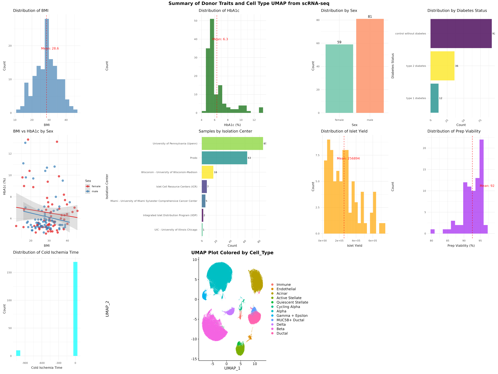
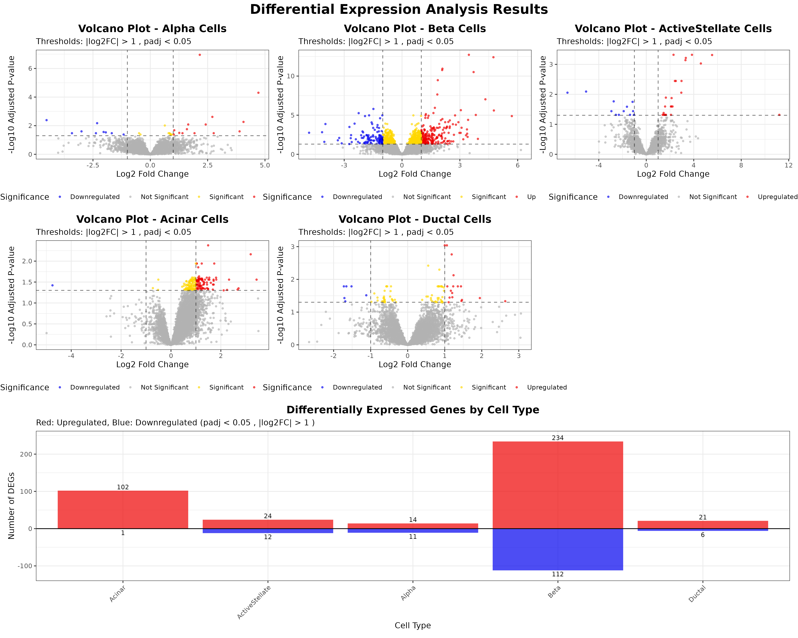

# PanKbase Analysis Scripts

Comprehensive R-based analysis toolkit for exploring pancreatic data from the PanKbase Data Library. This repository contains three complementary scripts for 1) snATAC metadata and single cell object exploration, and donor demographics visualization, 2) scRNA metadata and single cell object exploration, and donor demographics visualization, 3) differential expression analysis

```
PanKbase API/S3 Data
         ↓
Script 1 & 2: Metadata Analysis → Demographics & Quality Metrics 
+ 
Object Loading → Single-Cell Data Exploration
         ↓
Script 3: DEG Analysis → Gene Expression Insights
         ↓
Combined Results: Comprehensive PanKbase Data Analysis
```

---

## Scripts Overview

### 1. Metadata Analysis Script



Comprehensive metadata extraction and analysis for donor demographics, sample quality metrics, and experimental parameters.

**Key Features:**
- Robust API data extraction  
- Donor demographic analysis (age, BMI, diabetes status)  
- Sample quality metrics (yield, viability, isolation centers)  
- Correlation analysis and visualization  
- Configurable plot themes and parameters  

---

### 2. RDS Object Loading for Visualization and Downstream Analysis

1. **Direct Streaming (Recommended):**  
   Use `readRDS(url(rds_url, open = "rb"))` with extended timeout (`options(timeout = 3600)`) to stream the ~10GB file directly from S3 into memory.  

2. **Local Download Method:**  
   Download with `curl` or `download.file()` and load using `readRDS(local_file)`. Requires disk space but works offline.  

3. **Robust Error Handling:**  
   Built-in checks for file size, network conditions, fallback mechanisms, and timing metrics.  

4. **Performance Monitoring:**  
   Logs download speeds, file metadata, and load time for diagnostics.  

5. **Expected Performance:**  
   Direct streaming: 10–20 mins; local method requires space but enables reuse.  

---

### 3. DEG Analysis Script



Performs metadata extraction and analysis for differential expression gene (DEG) results across multiple pancreatic cell types (Alpha, Beta, Acinar, Ductal, and Active Stellate cells).

**Key Features:**
- Automated data loading from S3  
- Volcano plots and summary statistics  
- Comparative analysis across cell types  
- Customizable statistical thresholds  
- Publication-ready visualizations  

---

## Prerequisites

### System Requirements
- **R Version:** 4.0 or higher  
- **RAM:** 4GB minimum (8GB+ recommended)  
- **Internet:** Stable connection for PanKbase Data Library API/S3 access  
- **Storage:** Minimal (data streams from cloud)  

### Required R Packages

```r
# Automatically installed by scripts
packages <- c("httr", "jsonlite", "ggplot2", "dplyr", "readr", "tidyr", 
              "RColorBrewer", "gridExtra", "knitr", "viridis")
````

---

## Quick Start

### Metadata Analysis

1. Set `ANALYSIS_SET_ID` to your PanKbase dataset
2. Configure plot themes and parameters
3. Run complete script or execute cell-by-cell
4. Explore demographic and quality visualizations

### DEG Analysis

1. Set statistical thresholds in configuration section
2. Run script for automatic analysis of all cell types
3. Review volcano plots and summary statistics
4. Export gene lists for functional enrichment
---

## Configuration Options

| Parameter         | Default         | Description                               |
| ----------------- | --------------- | ----------------------------------------- |
| ANALYSIS\_SET\_ID | "PKBDS1349YHGQ" | PanKbase dataset identifier               |
| LOG2FC\_THRESHOLD | 1.0             | Minimum fold change for significance      |
| PVALUE\_THRESHOLD | 0.05            | Maximum adjusted p-value                  |
| PLOT\_THEME       | "minimal"       | ggplot theme (`minimal`, `bw`, `classic`) |
| COLOR\_PALETTE    | "Set2"          | Color scheme for visualizations           |
| HISTOGRAM\_BINS   | 15              | Number of histogram bins                  |

---

## Example Datasets

* `PKBDS1349YHGQ`: scRNA reference map
* `PKBDS0470WCHR`: ATAC-seq reference map
* `PKBDS5505XMWS`: Alpha cell-specific analysis

---

## Output Interpretations

### Metadata Analysis

* **Demographics:** Age, BMI, sex, diabetes status
* **Sample Quality:** Yield, viability, isolation center
* **Correlations:** Between metabolic variables
* **UMAP Plots and Cell Distribution**
  
### DEG Analysis

* **Volcano Plots:** Log2 fold change vs significance
* **Summary Statistics:** Gene counts by direction
* **Gene Lists:** Ready for enrichment analysis
---

## Troubleshooting

### Common Issues

#### Dataset Not Found

* Verify `ANALYSIS_SET_ID` is correct
* Check dataset at [PanKbase Data Library Search](https://data.pankbase.org/search/)

#### API Connection Problems

* Check your internet connection
* Increase timeout settings

#### Memory Issues

* Close unused apps
* Use `memory.limit(size = 8000)`
* Filter data more strictly

#### Package Installation

* Use `install.packages("package_name")`
* Update R
* Ensure internet access

---

## Performance

### Expected Runtime


* **Metadata Analysis:** \~5 minutes
* **DEG Analysis:** 2–5 minutes
* **Streaming/Downloading single cell object:** 10–20 minutes
    

---

## Integration

### Single-Cell Data

```r
# Direct S3 streaming (recommended)
rds_url <- "https://pankbase-data-v1.s3.us-west-2.amazonaws.com/analysis_resources/single_cell_objects/PanKbase_snatac_v1.rds"
seurat_obj <- readRDS(url(rds_url, open = "rb"))

# Combine with metadata
combined_analysis <- merge(donor_metadata, seurat_obj@meta.data, by = "donor_id")
```

---

## Data Export

```r
# Export processed data
write.csv(donor_metadata, "donor_demographics.csv", row.names = FALSE)
write.csv(all_deg_data, "deg_results.csv", row.names = FALSE)

# Save plots
ggsave("volcano_plots.pdf", combined_plots, width = 12, height = 8, dpi = 300)
```

---

## Resources

* [PanKbase Data Library](https://data.pankbase.org)
* [Dataset Search](https://data.pankbase.org/search/)
* [R Documentation](https://cran.r-project.org/)

---

## Citation

Users who wish to cite PanKbase in a scientific publication should do so in the following format:

PanKbase (https://www.pankbase.org), supported by NIDDK U24DK138515, U24DK138512, and supplemental funds from the NIH Office of Data Science Strategies. Year Month Date of access; URL of page cited. Specific identifiers/ accession numbers for datasets used.

Users citing donors, data and/or resources collected through a specific partner resource (e.g. HPAP, nPOD, ADI, IIDP, Pancreatlas) should also include the following citations and acknowledgements in their study:

HPAP 

PanKbase hosts data that was generated by the Human Pancreas Analysis Program (HPAP) and made publicly available by PANC-DB. The HPAP user agreement requires you to cite HPAP every time you use PANC-DB data for any publication purpose. In the acknowledgment section of your manuscript, please add this text:

This manuscript used data acquired from the database (https://hpap.pmacs.upenn.edu/) of the Human Pancreas Analysis Program (HPAP; RRID:SCR_016202; PMID: 31127054; PMID: 36206763). HPAP is part of a Human Islet Research Network (RRID:SCR_014393) consortium (UC4-DK112217, U01-DK123594, UC4-DK112232, and U01-DK123716). If scRNA-seq data is used, please also cite PMID: 35228745 and PMID: 37188822.

nPOD 

The Network for Pancreatic Organ donors with Diabetes (nPOD; RRID:SCR_014641) is a collaborative type 1 diabetes research project supported by grants from Breakthrough T1D/ The Leona M. & Harry B. Helmsley Charitable Trust (3-SRA-2023-1417-S-B) and the Helmsley Charitable Trust (2018PG-T1D053, G-2108-04793). Results and interpretation of analyses that include nPOD data are the responsibility of the authors and do not necessarily reflect the official view of nPOD. Organ Procurement Organizations (OPO) partnering with nPOD to provide research resources are listed at https://npod.org/for-partners/npod-partners/.

Additional information about how to identify nPOD samples in your work and other relevant guidelines can be found at the nPOD website (https://npod.org/publications/policies/).

ADI 

Human islets for research were provided by the Alberta Diabetes Institute IsletCore at the University of Alberta in Edmonton (http://www.bcell.org/adi-isletcore.html) with the assistance of the Human Organ Procurement and Exchange (HOPE) program, Trillium Gift of Life Network (TGLN), and other Canadian organ procurement organizations. Islet isolation was approved by the Human Research Ethics Board at the University of Alberta (Pro00013094). All donors' families gave informed consent for the use of pancreatic tissue in research.

This work includes data and/or analyses from HumanIslets.com funded by the Canadian Institutes of Health Research, JDRF Canada, and Diabetes Canada (5-SRA-2021-1149-S-B/TG 179092) with data from islets isolated by the Alberta Diabetes Institute IsletCore with the support of the Human Organ Procurement and Exchange program, Trillium Gift of Life Network, BC Transplant, Quebec Transplant, and other Canadian organ procurement organizations with written informed donor consent as approved by the Human Research Ethics Board at the University of Alberta (Pro00013094).

ADI HumanIslets.com web tool

    Ewald et al. (2024) HumanIslets.com: Improving accessibility, integration, and usability of human research islet data. Cell Metab. 2025 Jan 7;37(1):7-11. doi: 10.1016/j.cmet.2024.09.001. Epub 2024 Oct 1. PMID: 39357523.

ADI Proteomic data and RNAseq

    Kolic et al. (2024) Proteomic predictors of individualized nutrient-specific insulin secretion in health and disease. Cell Metabolism, Volume 36, Issue 7, 1619-1633.e5

ADI Patch-seq

    Dai et al. (2022) Heterogenous impairment of α cell function in type 2 diabetes is linked to cell maturation state. Cell Metabolism, 34(2):256-268.e5. doi: 10.1016/j.cmet.2021.12.021.
    Camunas-Soler et al. (2020) Patch-seq links single-cell transcriptomes to human islet dysfunction in diabetes. Cell Metabolism, 31(5):1017-1031.e4. doi: 10.1016/j.cmet.2020.04.005.

ADI Omics analysis results

    Robinson et al. (2009) edgeR: a Bioconductor package for differential expression analysis of digital gene expression data. Bioinformatics, 26(1):139-140. doi: doi.org/10.1093/bioinformatics/btp616

ADI Missing value imputation (processed proteomics data)

    Stekhoven et al. (2012) MissForest—non-parametric missing value imputation for mixed-type data, Bioinformatics, 28(1):112-118. doi: 10.1093/bioinformatics/btr597

ADI Batch correction (processed bulk RNAseq and Nanostring)

    Leek et al. (2012) The sva package for removing batch effects and other unwanted variation in high-throughput experiments, Bioinformatics, 28(6):882-883. doi: 10.1093/bioinformatics/bts034

ADI Pathway analysis libraries

    Gillespie et al. (2022) The reactome pathway knowledgebase 2022, Nucleic Acids Research, 50(D1): D687–D692, doi.org/10.1093/nar/gkab1028
    Kanehisa et al. (2023) KEGG for taxonomy-based analysis of pathways and genomes. Nucleic Acids Research, 51(D1): D587-D592, doi.org/10.1093/nar/gkac963
    The Gene Ontology Consortium. (2023) The Gene Ontology knowledgebase in 2023 Genetics, 224(1):iyad031. doi: 10.1093/genetics/iyad031

IIDP 

Acknowledgement and citation of IIDP as the source of resources and information, including any islets, tissue, slides, data, or images from the IIDP or any of their network webpages. Some experimental results were derived from human pancreatic islets and/or other resources provided by the NIDDK-funded Integrated Islet Distribution Program (IIDP) (RRID:SCR_014387) at City of Hope, NIH Grant # 2UC4DK098085.

An RRID for each isolation is obtained by the Islet Isolation Center when a pancreas becomes available for broadcast. The RRID replaces the UNOS ID and must be reported instead of the UNOS ID so that the donor’s identity remains confidential. The ancillary tissues, such as duodenum, blood, spleen, histology slides also will have an RRID. The RRIDs associated with each donor are linked to each other within the IIDP Research Data Repository.

Pancreatlas 

Please include the URL (https://www.pancreatlas.org) and RRID (RRID:SCR_018567) or reference our manuscript: Saunders, D. C. et al. Pancreatlas: Applying an Adaptable Framework to Map the Human Pancreas in Health and Disease. Patterns 1(8), 100120 (2020). DOI: 10.1016/j.patter.2020.100120.


---

## License

MIT License - Free to use, modify, and distribute with attribution.

---

### Get Help
- **Issues and Questions**: [GitHub Issues](https://github.com/PanKbase/data_analysis/issues)
- **Documentation**: Check cell comments in the notebook

---

**Version:** 2.0
**Last Updated:** June 2025
**Compatible with:** R 4.0+, PanKbase Data Library API v1
